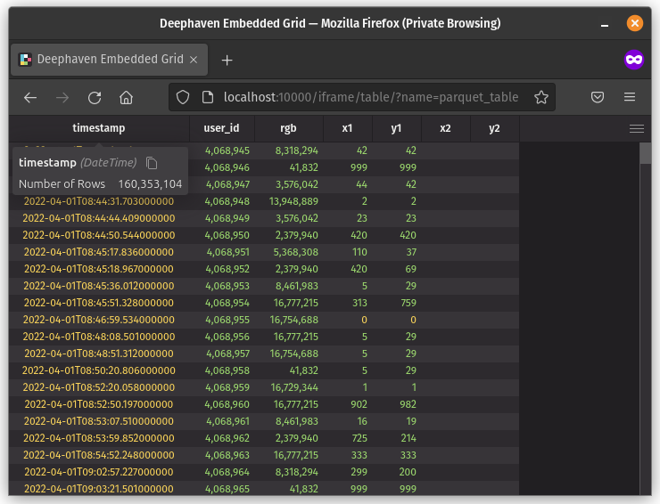

# Deephaven Parquet Viewer

A Parquet viewer powered by [deephaven-core](https://github.com/deephaven/deephaven-core). Supports opening and browsing through large (or small) parquet files.



## Helper script

```
Usage: deephaven-parquet-viewer.sh [parquet-file] ([port])
```

## Docker container

```shell
docker run \
    --rm \
    --name deephaven-parquet-viewer \
    --mount type=bind,source=/path/to/file.parquet,target=/file.parquet,readonly \
    -p 10000:10000 \
    ghcr.io/devinrsmith/deephaven-parquet-viewer:latest
```

## Browser

 * Table iframe: [http://localhost:10000/iframe/table/?name=parquet_table](http://localhost:10000/iframe/table/?name=parquet_table)
 * IDE: [http://localhost:10000/ide/](http://localhost:10000/ide/)

## Requirements

Linux, Mac OS (Intel or M1), and Windows WSL should all be supported. Docker is currently a requirement for running the helper script and via a Docker container, but advanced users can get the application running natively if desired.
